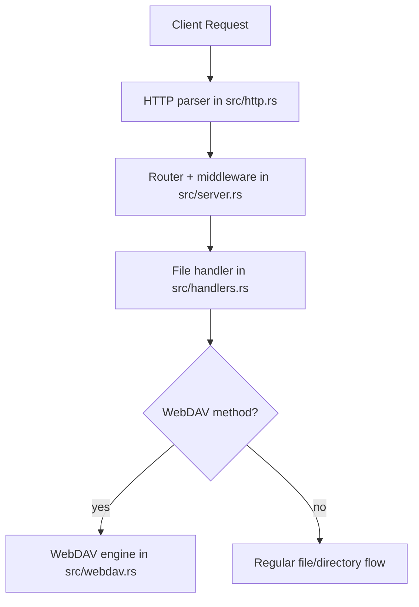
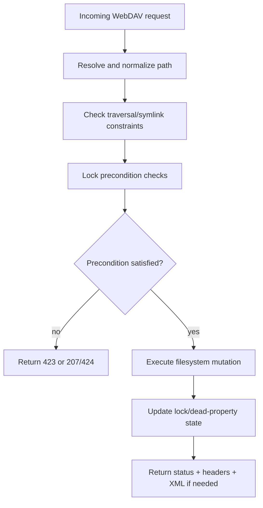
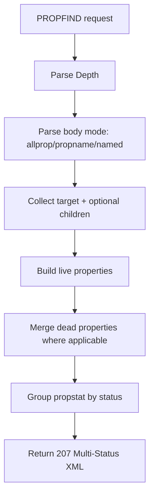
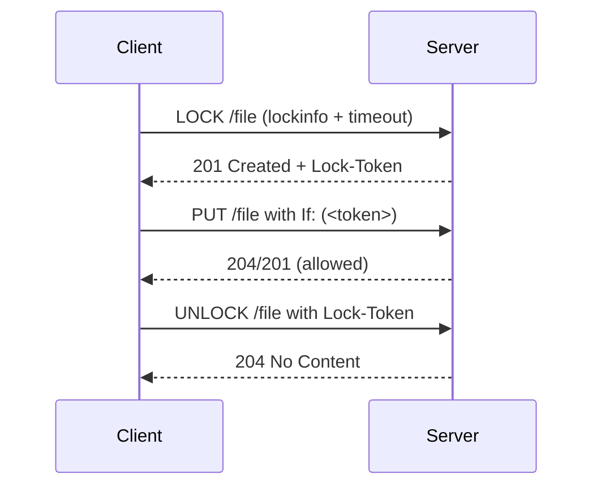

# WebDAV Implementation Guide

Version: 2.7.1

This guide explains how the WebDAV implementation works in plain language. It focuses on request flow, lock behavior, and the core RFC 4918 semantics implemented in `src/webdav.rs`.

## 1) High-level architecture

IronDrop routes WebDAV methods through the normal HTTP server path, then into a dedicated WebDAV engine.

### Methods currently handled

- `OPTIONS`
- `PROPFIND`
- `PROPPATCH`
- `MKCOL`
- `PUT`
- `DELETE`
- `COPY`
- `MOVE`
- `LOCK`
- `UNLOCK`

## 2) Request routing and feature gate

WebDAV methods are only processed when WebDAV is enabled in config/CLI. If disabled, WebDAV methods return `405 Method Not Allowed`.

Configuration controls:

- CLI: `--enable-webdav true|false`
- CLI: `--disable-rate-limit true|false` (effective only when WebDAV is enabled)
- INI: `[webdav] enable_webdav = true|false` (also accepted under `[server]`)
- INI: `[webdav] disable_rate_limit = true|false` (ignored when WebDAV is disabled)

## 3) Core request flow

Every mutating WebDAV request follows the same protection sequence:

## 4) PROPFIND logic (easy mental model)

IronDrop supports the common PROPFIND modes:

- `allprop`
- `propname`
- named `prop`

and depth handling:

- `Depth: 0` and `Depth: 1` for collections
- `Depth: infinity` on collections refused with RFC-shaped finite-depth precondition response

## 5) PROPPATCH logic

PROPPATCH operations are applied in document order and return per-property statuses in `207 Multi-Status`.

- dead property `set`/`remove` supported
- protected/live properties rejected with `403` in property-level `propstat`
- malformed or empty updates rejected with `400`

## 6) COPY/MOVE/DELETE logic

These operations enforce destination and lock preconditions before mutation.

### COPY/MOVE checks

- valid `Destination` required
- `Overwrite` semantics honored
- source-under-destination loops rejected
- lock checks run on source and destination where required

### DELETE behavior

- locked descendants produce multi-status (`207`) with dependency semantics (`423`/`424`) when applicable

## 7) LOCK/UNLOCK and If-header flow

Locking is class-2 style exclusive write locking with token-based authorization.

Key points:

- new lock returns `201`
- refresh lock returns `200`
- wrong/missing token on locked mutation returns `423`
- wrong token on unlock returns `409`

## 8) Dead properties and lock lifecycle

The engine keeps dead properties and lock metadata in-memory for active process lifetime.

- delete/move/copy paths update related state
- state is non-persistent across server restarts

## 9) Operational troubleshooting

If a client reports odd behavior, check in this order:

1. WebDAV flag enabled (`--enable-webdav` / INI)
2. auth result (401s in log)
3. rate-limiter behavior (burst-heavy clients can be throttled unless WebDAV `disable_rate_limit` is enabled)
4. lock token flow (`LOCK`/`If`/`UNLOCK`)
5. method/status pair in logs (`PROPFIND -> 207`, `LOCK -> 201`, etc.)

## 10) Current scope limits

Implemented scope is RFC 4918 Class 1 + Class 2 core behavior used by common clients.

Not in scope:

- ACL/versioning/bindings extensions (`RFC 3744`, `RFC 3253`, `RFC 5842`)
- persistent lock/dead-property storage across restarts
